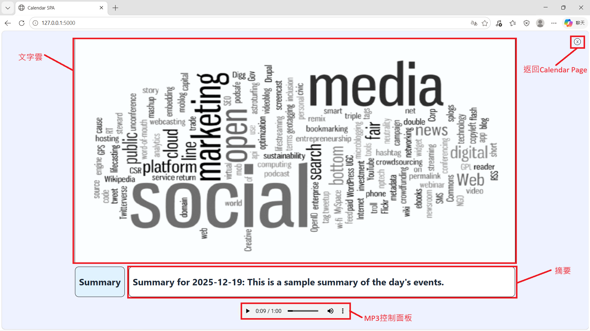

## 專案執行流程
### 建立環境
1. 下載專案
   
	```
 	git clone https://github.com/yos0727/nlp_final_project.git
 	```
 
2. 進入repo
   
	```
 	cd nlp_final_project
	```

3. 建立虛擬環境

	```
 	python -m venv .venv
 	```
	如果 python 不在環境變數裡
	```
	<python.exe的路徑> -m venv .venv
	```
	預設的python安裝路徑
	C:\Users\\`user name`\\AppData\\Local\\Programs\\Python\\`python version`\\python.exe

4. 啟動虛擬環境

	```
	.venv\Scripts\activate
	```

5. 安裝套件

	```
 	pip install -r requirements.txt
 	```

### 執行專案
1. 在終端輸入
   
	```
	python app.py
	```
3. 在瀏覽器輸入
   
	```
	http://127.0.0.1:5000
	```

## GUI操作說明
### Calendar Page

### Summary Page
